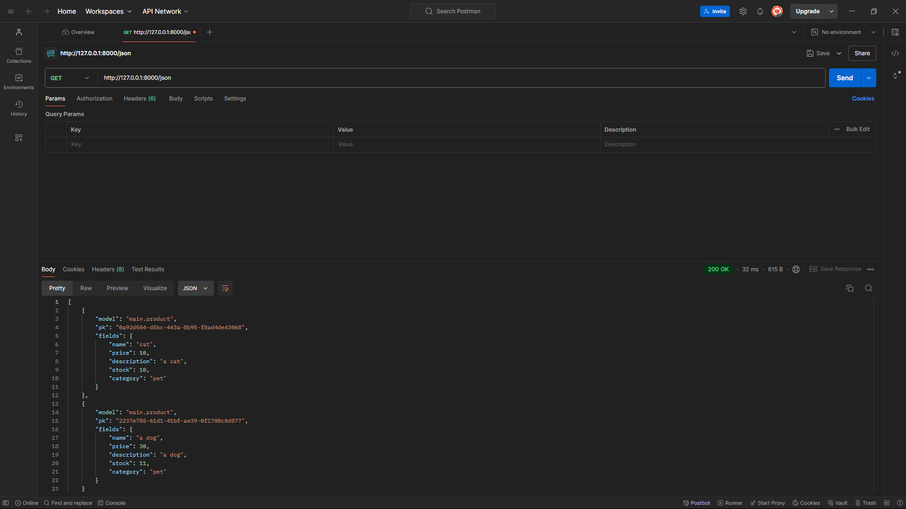
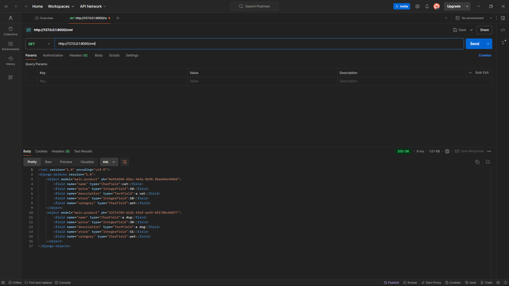
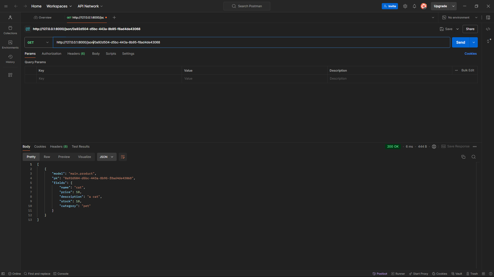
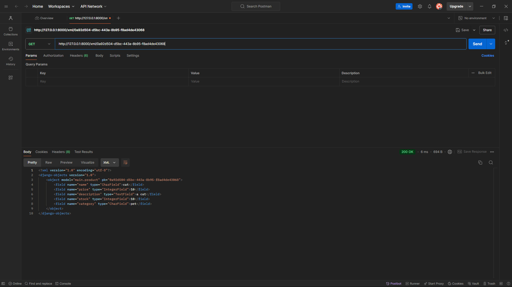

<h1>Website Link: http://alano-davin-loomandharvest.pbp.cs.ui.ac.id/</h1>

<hr>

<h2><b>Assignment 2</b></h2>

<b>Explain how you implemented the checklist above step-by-step (not just following the tutorial).</b>

When doing assignment 2, I attempted to create the app and its functions, like the tutorial. However, I also attempted to expand my understanding by applying my own features and observing the effectiveness of my implementation.

I started by creating the directory simply in File Explorer. From here, I ran the needed Python command "python -m venv env" to create the virtual environment. From there, I opened the directory at a command prompt and activated the environment with the command "envScriptsactivate."

Once in the environment I went to the file explorer and created a text document and I filled it with the needed packages to run the project. I saved this file as a requirements.txt file and allowed for the directory to download all needed packages with the command "pip install -r requirements.txt". This allows the directory to install and have all dependencies ready before the project starts.

After all the setup had been finished, I created a Django project within the directory. To achieve this, I used the command "django-admin startproject" followed by the name of my project, loom_harvest. This created a project folder and directory from which I will run all my Django apps, within the project directory there remains a few things I have to modify such that it can run on the PWS server. The first thing I had to modify was the allowed hosts. This configuration is found in the settings.py of the project directory and commiting to memory I added the localhost and the PWS deployment URL.

After setting up the allowed hosts I used the command "python manage.py runserver" in order to test whether the server could deploy. This ran flawlessly since I noted down the process from past tutorials. Now that the basic setup of the project was done it was possible to follow the checklist of the assignment.

Since I had already created a Django Project I proceeded to create a Django app named "main" using the following command "python manage.py startapp main" in the terminal. This created two files within my project directory, the project itself and the app main. I followed this by applying routing by creating a set of urls.py files found in the app and project directory. While the name of these files are the same they ultimately serve different functions with different contents. The urls.py found within the project directory is to facilitate the running of the main application whereas the urls.py found in the app directory is for the views.py to function. The contents within the urls.py found in the project directory are as follows:

```python
urlpatterns = [
 path('admin/', admin.site.urls),
 path('', include('main.urls')),
]
```
The need for this code exists such that the default Django admin interface will connect and the "include('main.urls') exist to allow the root URL of the website to be set such that users can easily be redirected to that page.

Following that step was the creation of the models.py file within the application directory. It was asked by the assignment to create a model with the name 'Product' and the fields name, price, and description. Therefore, to achieve this, I wrote the following code:

```python
class Product(models.Model):
 name = models.CharField(max_length=255)
 price = models.IntegerField()
 description = models.TextField()
 stock = models.IntegerField(default=0)
 category = models.CharField(max_length=255, blank=True)

    def __str__(self):
        return self.name
```

I created the Product itself with the fields name, price, description, stock, and category. I applied the most appropriate data type per field and for some I added limits or max lengths as I saw that was standard practice online. Another standard practice feature I noticed was the use of a __str__ function which simply just returned the name of the Product.

After creating a models.py I made the views.py function that will return to the HTML code. For this section I applied the method from the tutorial but I attempted to add my understanding to it. I associated the idea of views.py as simply labeling and returning variables and their values. Therefore, I simply matched the variables and values to their appropriate designations and applied it in the HTML template.

```python
def show_main(request):
 context = {
        'project_name': 'Loom and Harvest',
        'app_name': 'main',
        'developer_name': 'Alano Davin Mandagi Awuy',
        'class_name': 'KKI'
 }
    return render(request, 'main.html', context)

```

I modified the function's context data structure to include a few more features such as the project name which I set as the title and a header in the HTML page followed by the other requirements of the task which are mapped to elements in the HTML.

For this to work, I had to fill the urls.py in the app directory with the following code:

```python
urlpatterns = [
 path('', show_main, name='show_main'),
]
```

This simply maps the function from the views.py to the template found in the HTML. This allows for the code to recognize the function and allow for views.py to send the needed data to the HTML.


Once this is done I switched the remote URL for my git such that I can push the website into the PWS server and allow others to view it on the internet.

<b>Create a diagram that contains the request client to a Django-based web application and the response it gives, and explain the relationship between urls.py, views.py, models.py, and the html file.</b>


The urls.py is tasked with being the middleman between the user and the application. It tells Django which view or views.py file should interact with the user. Therefore, it acts as a sort of redirect for the views.py file. The views.py file is responsible for handling user requests, interacting with models, and rendering templates. The relationship between views.py and other components lay within the models.py, from which it retrieves objects and the HTML file where it displays said data. The models.py interacts with the views.py and the database. The models.py receives instructions from the views.py and retrieves the needed data from the database. Finally, the HTML file is what the user gets to view the webpage on their browser.

<b>Explain the use of git in software development!</b>

Git in software development has two main focuses to why it is used in software development which are collaboration and security. Git allows users and teams to share code and push their updates individually, allowing for each member to work at their own pace while having the most updated version of their project. It also allows project managers to manage which code gets accepted, review push requests, and credit whoever implemented the change. This also works to distribute open-source software and free software. The security feature regards to code review, backups, and version control. Teams can review each others code before implementing it ensuring security among code projects. Backups and version control protects code from errors by allowing rollbacks and for version recalls in the event of an error.

<b>In your opinion, out of all the frameworks available, why is Django used as the starting point for learning software development?</b>

Django was chosen because it is an AIO (All in One) framework with clear documentation and a strong community. This allows any entry level developer to get into Django and if they are stuck they have many resources to help them overcome the issue. Furthermore, Django is secure providing advanced protection against common attacks. Django also promotes common practices in the industry and has proven to be very scalable. This means a learner can easily scale their project as they improve their skills or get more people to work with them.

<b>Why is the Django model called an ORM?</b>

Django is called an ORM (Object Relational Mapping) because it allows developers to access the database using Python objects, instead of raw SQL queries. It abstracts the process of interacting with a database by allowing objects to interact directly with database tables, mapping it to the database concept. Thus, Django uses its model classes and its fields to map to the database table and columns. Django also allows for operations on the table, like updating and saving, without the need for SQL queries. The reason Django uses ORM is for the productivity, security, and portability of web applications and code. This is done by allowing developers to focus on other concentrations while still making their database available to SQL software. It also gives a layer of security against SQL injection attacks.

<hr>

<h2><b>Assignment 3</b></h2>

<b>Explain why we need data delivery in implementing a platform.</b>

Data delivery helps implement a platform because it enables communication between components within the system such as different files or data, ensuring that information is exchanged reliably and efficiently. The use of data delivery in platforms ensures data consistency, supports scalability, enhances user experience, and facilitates integration with external services. Secure and timely data delivery is crucial for maintaining the integrity of transactions, providing real-time updates, and enforcing business logic across the platform. Without proper data delivery mechanisms, a platform would face issues with performance, data reliability, and security.

<b>In your opinion, which is better, XML or JSON? Why is JSON more popular than XML?</b>

JSON is generally considered more suitable for modern applications due to its lightweight structure, ease of use, and faster parsing compared to XML. JSON's simple, human-readable format allows for efficient data exchange, particularly in web APIs and applications that places performance as essential. Despote XML being more robust in terms of supporting metadata and hierarchical data structures, it is more complex, making it less efficient for common web applications. JSON's popularity stems from its integration with JavaScript, widespread adoption in web development, and better performance in terms of processing speed and data transfer.

<b>Explain the functional usage of is_valid() method in Django forms. Also explain why we need the method in forms.</b>

The `is_valid()` method in Django forms is used to validate  data submitted toe hte web app. When the function is called, it verifies the data entered into the form meets the validation rules set in the fields, such as correct data types, required fields, and custom validation logic. If all the data is valid, `is_valid()` returns `True` if not it returns `False` and stores the errors in the `form.errors` attribute. The `is_valid()` method is important because it ensures that only valid data is processed or saved into the database, preventing errors or incorrect data entry. Without the function it could lead to application errors, data corruption, or security vulnerabilities.

<b>Why do we need csrf_token when creating a form in Django? What could happen if we did not use csrf_token on a Django form? How could this be leveraged by an attacker?</b>

The `csrf_token` is essential in Django forms to protect against Cross-Site Request Forgery (CSRF) attacks. CSRF is a type of attack where a malicious website tricks a user’s browser into submitting a form or request on another website where the user is authenticated. Django's `csrf_token` ensures that form submissions originate from the legitimate website by generating a unique token for each session, which must be included in the form submission. If the token is missing or incorrect, Django rejects the request.

The absence of the `csrf_token` will allow an attacker or third-party to submit a dangerous form which grants them admin powers allowing them to trick the website into thinking they can authorize changes and view data. Since they become an authenticated user they can trick the form into changing settings, deleting data, and many more harmful actions. The vulnerabilityy could allow hackers to stal data and access even deeeper parts of the website compromising the website. Therefore, there is a need for a `csrf_token` to constantly authenticate and protect the user's and system's ability to accept and return forms on both ends.


<b>Explain how you implemented the checklist above step-by-step (not just following the tutorial).</b>

The first step was adding the id to the models.py file so that it had the UUID variable giving a unique ID to each entry or 'Product' created.
```python
    import uuid
    id = models.UUIDField(primary_key=True, default=uuid.uuid4, editable=False)
```

After ensuring that the web application will be able to distinguish different entries using the unique ID I prepared to make the forms.py so that web application will have a form format to follow when creating, validating, and saving the values from user input.
```python
    from django.forms import ModelForm
    from main.models import Product

    class ProductForm(ModelForm):
        class Meta:
            model = Product
            fields = ["name", "price", "description", "stock", "category"]
```
Within the code I intialized the fields for the object so that the models.py and forms.py had conformed to one singular format.

Once the formatting was compelete I had to make sure the implementation and utilization of these formats and models were complete. To do so I added a new  `create_product` function in the

```python
    def create_product(request):
        if request.method == "POST":
            form = ProductForm(request.POST)
            if form.is_valid():
                form.save()  # Save the new product to the database
                return redirect('main:show_main')  # Redirect to the product listing page
        else:
            form = ProductForm()  # Display an empty form for GET requests

        context = {'form': form}
        return render(request, "create_product.html", context)

```

Further modification to the views.py file was needed in the form of adding to the context of `the show_main`the products variable. This contains the data of all objects so that the the values and data can be returned to the HTML templates.

```python
    def show_main(request):
        products= Product.objects.all()

        context = {
            'project_name': 'Loom and Harvest',
            'app_name': 'main',
            'developer_name': 'Alano Davin Mandagi Awuy',
            'class_name': 'KKI',
            'products': products
        }
        return render(request, 'main.html', context)

```

Once these were done I had to prepare the HTML files by first adding a templates folder in the root directory and creating a base.html file. The contents will include a standardized format for each html page but no actual content.
```
    

    
    <h1>Add New Product</h1>

    <form method="POST">
    
    <table>
        {{ form.as_table }}
        <tr>
        <td></td>
        <td>
            <input type="submit" value="Add Product" />
        </td>
        </tr>
    </table>
    </form>

    

```
Due to this change I had to accomodate for the other html files in the main app directory which are the main.html and the new form html called the create_product.html which was a redirect that led users to a form for them to fill out and submit data. Due to the change of a base.html in the root directory there was a need to extend the base.html of all the other html files since it must extend from the root directory.

```
    
```

Ensuring that this is all sound the settings.py needs to be able to recognize and use the new base template. To achieve this all I added was a directory path so that the code can identify and implement the html.

```python
        'DIRS': [BASE_DIR / 'templates'], # Adding the templates directory to the TEMPLATES setting
```

Now that this was done I needed to implement a way for all the data to be visible on the page was entered. Using what I learned last week I created a loop to display all the data in the order they were created.

```
    
        <p>There are no products in the inventory.</p>
    
        <table>
            <tr>
                <th>Product Name</th>
                <th>Price</th>
                <th>Description</th>
                <th>Stock</th>
                <th>Category</th>
            </tr>
    
            
            <tr>
                <td>{{ product.name }}</td>
                <td>{{ product.price }}</td>
                <td>{{ product.description }}</td>
                <td>{{ product.stock }}</td>
                <td>{{ product.category }}</td>
            </tr>
            
        </table>
    
```

Now I had to create a way to view the data without having to use any SQL apps. For this I followed the tutorial's guide on showing the XML and JSON as is and by id.

```python
    def show_xml(request):
        data = Product.objects.all()  # Fetch all Product objects
        return HttpResponse(serializers.serialize("xml", data), content_type="application/xml")

    # View to return data in JSON format
    def show_json(request):
        data = Product.objects.all()  # Fetch all Product objects
        return HttpResponse(serializers.serialize("json", data), content_type="application/json")

    def show_xml_by_id(request, id):
        data = Product.objects.filter(pk=id)
        return HttpResponse(serializers.serialize("xml", data), content_type="application/xml")

    def show_json_by_id(request, id):
        data = Product.objects.filter(pk=id)
        return HttpResponse(serializers.serialize("json", data), content_type="application/json")
```

After all of the steps were finished I simply had to modify the urls.py so that all the pages and py files can communicate with one another. I simply added a path for the url so that it can reach each intended value or page.

```python
    path('create_product', create_product, name='create_product'),
    path('xml/', show_xml, name='show_xml'),
    path('json/', show_json, name='show_json'),
    path('xml/<str:id>/', show_xml_by_id, name='show_xml_by_id'),
    path('json/<str:id>/', show_json_by_id, name='show_json_by_id'),
```

After testing and finishing the steps the app ran as intended.

<h3>Postman Screenshots</h3>
<b>Access the four URLs in point 2 using Postman, take screenshots of the results in Postman, and add them to README.md.</b>
<h2>JSON</h2>



<h2>XML</h2>



<h2>JSON by ID</h2>



<h2>XML by ID</h2>



<hr>

<h2><b>Assignment 4</b></h2>

<b>What is the difference between HttpResponseRedirect() and redirect()?</b>

`HttpResponseRedirect()` is a class in Django that handles HTTP redirects by sending a 302 status code, along with the new URL, to the browser. This requires a full URL as the function's argument and will programmatically control where a user redirects after a request is sent. On the other hand, `redirect()` is a helper function by Django that simplifies the same process by allowing you to pass either a URL string or a URL name from `urls.py`, and even a model object can be parsed. The `redirect()` function automatically determines the appropriate URL to redirect to, making it easier to use.

<b>Explain how the MoodEntry model is linked with User!</b>

The `Product` model is linked to the `User` model through a foreign key relationship using Django's built-in `User` model from `django.contrib.auth.models`. This means each `Product` is associated with a specific user, allowing users to have individual Product data. This makes a one to many relationship between the User and the Products.

<b>What is the difference between authentication and authorization, and what happens when a user logs in? Explain how Django implements these two concepts.</b>

Authentication refers to the process of verifying a user's identity, while authorization determines what resources or actions a user is allowed to access once authenticated. When a user logs in, Django first authenticates the credentials against the database, and if successful, the user is marked as authenticated. Django implements authentication using middleware that manages user sessions, allowing logged-in users to be tracked across requests. Authorization in Django is handled through permissions, either assigned to users or groups, determining what actions they are allowed to perform based on their role or permissions.

<b>How does Django remember logged-in users? Explain other uses of cookies and whether all cookies are safe to use.</b>

Django remembers logged-in users by using session cookies, which store a unique session ID in the user’s browser. This session ID is associated with the user’s data on the serveror localhost, allowing Django to remember the user across multiple requests. Cookies have other uses, such as storing preferences, tracking analytics, and personalizing content. However, not all cookies are safe—some cookies, particularly third-party or tracking cookies, may be used to gather information about users without their consent.

<b>Explain how did you implement the checklist step-by-step (apart from following the tutorial)</b>

To begin I created a login function for the web app such that user's can input their credentials and login to the website and reach the main page through the main.html.

```python
    user = form.get_user()
    login(request, user)
    return redirect('main:show_main')
```

Then I proceeded to make a login.html file that I placed in the main/templates and I ensured that I included the csrf_token to ensure that each login or session can be verified.

```python
    <form method="POST" action="">
    
    <table>
        {{ form.as_table }}
        <tr>
        <td></td>
        <td><input class="btn login_btn" type="submit" value="Login" /></td>
        </tr>
    </table>
    </form>
```

This provides security for the user and website itself only granting accessed to the right user.

After making a login fuction which will redirect valid users to the main.html page I had to make a way for them to either terminate their session or switch users. To implement this I created the logout function which would terminate the current session and allow for other users to login.

```python
def logout_user(request):
    logout(request)
    return redirect('main:login')
```

This code exist within the views.py section of the code like the login function. The difference is that it will use from the Django package the logout function terminating the session and sending users to the login.html page. To complement this I added a logout button on the main page so users can sign out.

Next I had to restrict access so that only verified users can access the page. To do this I used:
```python
@login_required(login_url='/login')
def show_main(request):
```
This was done so that the show_main function will only ever run should a login be valid. THis gurantees that no unregistered users can access the page. I also asked for cookies related to their last login session to ensure that each user atleast has that to be let into the page.

```python
if form.is_valid():
    user = form.get_user()
    login(request, user)
    response = HttpResponseRedirect(reverse("main:show_main"))
    response.set_cookie('last_login', str(datetime.datetime.now()))
    return response
```

Within the login_user function so that each time they login and a valid form is checked it will update their cookies and redirect them to the main page.

Finally I modified the Product in models.py to have the variable user as shown in:

```python
    user = models.ForeignKey(User, on_delete=models.CASCADE)
```

Next I created the register.html and register_user function so that every new user can register themselves to the webpage. Once the user registered correctly it will allow them to return to the login page and thus login.

```python
def register_user(request):
    form = UserCreationForm()
    if request.method == "POST":
        form = UserCreationForm(request.POST)
        if form.is_valid():
            form.save()
            messages.success(request, 'Account was created for ' + form.cleaned_data['username'])
            return redirect('main:login')
    context = {'form':form}
    return render(request, 'register.html', context)
```

I then had to make changes to the urls.py so that each component can communicate with one another and present the correct data. To do this I edited the url pattern and added the following:

```python
    path('register/', register_user, name='register'),
    path('login/', login_user, name='login'),
    path('logout/', logout_user, name='logout'),

```

After this I migrated everything and modified the settings.py so that it will work with the changes with the code
```python
import os

PRODUCTION = os.getenv("PRODUCTION", False)
DEBUG = not PRODUCTION
```

| User    | Password        |
|---------|-----------------|
| dummy1  | Thisisaduummy1  |
| dummy3  | Thisisaduummy3  |

<hr>

<h2><b>Assignment 5</b></h2>

<b>If there are multiple CSS selectors for an HTML element, explain the priority order of these CSS selectors!</b>

When multiple CSS selectors apply to an HTML element, their priority is determined by a concept called specificity. Specificity is calculated based on the type of selector used. Inline styles, which are defined directly on an element, have the highest priority. After inline styles, IDs are given the most weight, followed by class selectors, pseudo-classes, and attribute selectors. Finally, element selectors and pseudo-elements have the lowest priority. If two or more selectors have the same specificity, the one that appears later in the CSS file will override the earlier one due to the latest one being more recent.

<b>Why does responsive design become an important concept in web application development? Give examples of applications that have and have not implemented responsive design!</b>

Responsive design is critical in web application development because it ensures that a website or application functions and looks good across different devices, including desktops, tablets, and mobile phones. As people access the web through different screen sizes, from large monitors to small smartphones, it's essential to ensure that the user experience remains consistent and effective across all devices. Responsive design employs techniques such as flexible grids, media queries, and fluid images to adapt the layout and content to different screen sizes. On the other hand, some older websites or applications that have not yet adopted responsive design may appear broken or difficult to navigate on mobile devices, often requiring zooming and excessive scrolling. 

<b>Explain the differences between margin, border, and padding, and how to implement these three things!</b>

Margin, border, and padding are three essential properties in CSS that define the space around elements. Margin refers to the space outside the element's border, controlling the distance between the element and its neighboring elements. It is used to create space around an element. Padding, on the other hand, refers to the space inside the element's border, between the content and the element's edge. It helps in controlling the spacing between the element's content and its boundary. The border is the line between the margin and the padding, surrounding the element itself. It can be styled with various widths, colors, and patterns to give visual emphasis to the element. For example, an element can have padding to ensure text doesn’t touch its edges, a border to give it a defined boundary, and margin to create space between it and other elements.

<b>Explain the concepts of flexbox and grid layout along with their uses!</b>

Flexbox and grid layout are two powerful CSS tools used for designing responsive web layouts. Flexbox, or Flexible Box Layout, is ideal for creating one-dimensional layouts, meaning it is well-suited for organizing items in either a row or column. It allows for easy alignment, distribution of space, and adaptability of elements within a container. Flexbox is particularly useful for layouts that require elements to adjust dynamically to the available space, such as navigation bars or toolbars, where items need to be spaced evenly or aligned along a central axis.

Grid layout, on the other hand, is a two-dimensional layout system that allows developers to design complex web layouts involving both rows and columns. Unlike Flexbox, which only works in one direction at a time, Grid allows for full control over both axes simultaneously. This makes it highly suitable for page layouts that require a well-structured grid, such as gallery layouts, dashboards, or magazine-style pages. Grid layout excels at designing large-scale layouts where elements need to be placed with precise control over both their row and column positioning. Both systems can be combined in modern web design to create flexible, responsive layouts that work across different screen sizes.

<b>Explain how you implemented the checklist above step-by-step (not just following the tutorial)!</b>

The first step I took in implementing this assignment was applying tailwind into my code. I chose tailwind over bootstrap since I found that tailwind was easier and more upto date in terms of when it was released. To do this I added the following code into my base.html:
```python
<script src="https://cdn.tailwindcss.com">
```
Adding this to my base.html will apply it to all my html files since every file extends from base.html thus allowing me to use tailwind.

After I applied tailwind to all my files I then moved on to creating my edit and delete functions for the data. To do this I started with the delete product function since it does not require its own html file to function. To delete the product I simply attached each product in the main.html with a delete button which is binded to their uuid. The function to delete will take their id and parse it to find the item to delete. Once found it will simply delete the entire item removing from the table. Unlike the tutorial I added a message to notify the user wheteher their transaction was succesful or not. I did this by throwing an error message and later using and conditional statement to display the message's nature which is delete. The final code looked like the following:
```python
def delete_Product(request, id):
    product = Product.objects.get(pk=id)
    product_name = product.name
    product.delete()
    # Set the delete message as an error (which we will style as red)
    messages.error(request, f'Product "{product_name}" was deleted successfully!')
    return HttpResponseRedirect(reverse('main:show_main'))
```

To compliment the fuctionality of the messages offered by the delete function I also incorporated the message function to also work on the create_product such that when a succesful product instance is added to the database a message will notify the users. This was done with the code line:

```python
    messages.success(request, f'Product "{product.name}" was created successfully!')
```

Finally, I created the edit_product function by following the tutorial. In this instance I applied the same concept as the delete_product but instead of deleting the product after calling it I instead edited it through the form. I also added the success message here for a case where the edit of the data was succesful.

```python
def edit_Product(request, id):
    # Get product entry based on id, raise 404 if not found
    product = get_object_or_404(Product, pk=id)

    # Set product entry as an instance of the form
    form = ProductForm(request.POST or None, instance=product)

    if form.is_valid() and request.method == "POST":
        # Save form and return to the main page
        form.save()
        # Add success message after product edit
        messages.success(request, f'Product "{product.name}" was edited successfully!')
        return HttpResponseRedirect(reverse('main:show_main'))

    context = {'form': form, 'product': product}
    return render(request, "edit_Product.html", context)
```

Of course adding a message function requried that I gave the website a way to display this. I used an elif stataement to determine whether the color of the notification should be green or red based on whether they are an error or not from the message I raised within the function. I also added this message feature to the register page of the website.

```html

    
    <div class="mt-4">
      
        
        <div class="bg-green-100 border border-green-400 text-green-700 px-4 py-3 rounded relative mb-4">
          {{ message }}
        </div>
        
        <div class="bg-red-100 border border-red-400 text-red-700 px-4 py-3 rounded relative mb-4">
          {{ message }}
        </div>
        
      
    </div>
    
    
```

To display the data I was inspired by the tutorial to make cards to display the data. However, one thing I did not agree with was the design and formatting of the cards. So I designed a smaller and more concise card. I then created two html files a card_product.html and card_info.html to display the cards and data. I also added a minor animation detail different from the tutorial's website with the rotate function to indicate which card is being selected.

```html
    <div class="relative top-5 bg-gray-900 shadow-md rounded-lg mb-2 break-inside-avoid flex flex-col border-2 border-gray-700 transform transition-transform duration-300 hover:rotate-1" style="max-width: 280px;">
```

I then worked on the styling of the website. I created a static folder and allowed the settings.py detect it. I updated the middleware to accomodate all the new functions such as reading the css files and to view the media. After modfying the settings.py I created a static folder in the root directory called static. Inside I made two subdirectories image and css. Here I stored the the image media I intended to put in my website and I stored the global.css. I had to refrence the css to the base.html so it would be applied everywhere. With the code:

```html
    <link rel="stylesheet" href=""/>
```

After this I made a navbar.html and made it be included it every html file where it is applicable with the include tag in the content block at the top of each website. Once this was complete I was done with the website, I then just styled every page with a consistent dark theme inspired the popular dark theme on most systems. To do this I just manipulated the css in each local page. I change bg colors to fit the dark theme; I lightened text to contrast the text and many other changes.