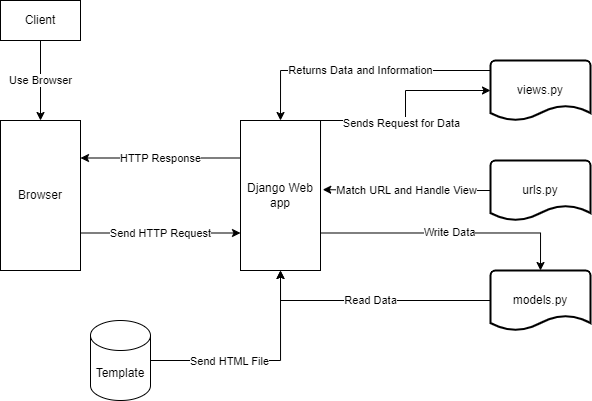

<h1>Website Link: http://alano-davin-loomandharvest.pbp.cs.ui.ac.id/</h1>

<hr>

<b>Explain how you implemented the checklist above step-by-step (not just following the tutorial).</b>

When doing the assignment 2 I attempted to create the app and its functions like the tutorial. However, I attempted to expand my understanding by applying my own features and observing the effectiveness of my implementation.

I started with the creation of the directory simply done in file explorer. From here I ran the needed python command "python -m venv env" in order to create the virtual environment. From there I opened the directory on a command prompt and I activated the environment with the command "env\Scripts\activate".

Once in the environment I went to the file explorer and created a text document and I filled it with the needed packages to run the project. I saved this file as a requirements.txt file and allowed for the directory to download all needed packages with the command "pip install -r requirements.txt". This allows the directory to install and have all dependencies ready before the project starts.

After all the setup has been finished I created a Django project within the directory, to achieve this I used the command "django-admin startproject" followed by the name of my project loom_harvest. This created a project folder and directory from which I will run all my Django apps, within the project directory there remains a few things I have to modify such that it can run on the PWS server. The first thing I had to modify was the allowed hosts. This configuration is found in the settings.py of the project directory and commiting to memory I added the localhost and the PWS deployment URL.

After setting up the allowed hosts I used the command "python manage.py runserver" in order to test whether the server could deploy. This ran flawlessly since I noted down the process from past tutorials. Now that the basic setup of the project was done it was possible to follow the checklist of the assignment.

Since I had already created a Django Project I proceeded to create a Django app named "main" using the following command "python manage.py startapp main" in the terminal. This created two files within my project directory, the project itself and the app main. I followed this by applying routing by creating a set of urls.py files found in the app and project directory. While the name of these files are the same they ultimately serve different functions with different contents. The urls.py found within the project directory is to facilitate the running of the main application whereas the urls.py found in the app directory is for the views.py to function. The contents within the urls.py found in the project directory are as follows:

```python
urlpatterns = [
    path('admin/', admin.site.urls),
    path('', include('main.urls')),
]
```
The need for this code exists such that the default Django admin interface will connect and the "include('main.urls') exist to allow the root URL of the website to be set such that users can easily be redirected to that page.

Following that step was the creation of the models.py file within the application directory. It was asked by the assignment to create a model with the name 'Product' and the fields name, price, and description. Therefore, to achieve this I wrote the following code:

```python
class Product(models.Model):
    name = models.CharField(max_length=255)
    price = models.IntegerField()
    description = models.TextField()
    stock = models.IntegerField(default=0)
    category = models.CharField(max_length=255, blank=True)

    def __str__(self):
        return self.name
```

I created the Product itself with the fields name, price, description, stock, and category. I applied the most appropriate data type per field and for some I added limits or max lengths as I saw that was standard practice online. Another standard practice feature I noticed was the use of a __str__ function which simply just returned the name of the Product.

After creating a models.py I made the views.py function that will return to the HTML code. For this section I applied the method from the tutorial but I attempted to add my understanding to it. I associated the idea of views.py as simply labeling and returning variables and their values. Therefore, I simply matched the variables and values to their appropriate designations and applied it in the HTML template.

```python
def show_main(request):
    context = {
        'project_name': 'Loom and Harvest',
        'app_name': 'main',
        'developer_name': 'Alano Davin Mandagi Awuy',
        'class_name': 'KKI'
    }
    return render(request, 'main.html', context)

```

I modified the function's context data structure to include a few more features such as the project name which I set as the title and a header in the HTML page followed by the other requirements of the task which are mapped to elements in the HTML.

For this to work I had to fill the urls.py in the app directory with the following code:

```python
urlpatterns = [
    path('', show_main, name='show_main'),
]
```

This simply maps the function from the views.py to the template found in the HTML. This allows for the code to recognize the function and allow for views.py to send the needed data to the HTML.


Once this is done I switched the remote URL for my git such that I can push the website into the PWS server and allow others to view it on the internet.

<b>Create a diagram that contains the request client to a Django-based web application and the response it gives, and explain the relationship between urls.py, views.py, models.py, and the html file.</b>


The urls.py is tasked with being the middleman between the user and the application. It tell Django which view or views.py file should interact with the user. Therefore, it acts as a sort of redirect for the views.py file. The views.py file is responsible for handling user requests, interacting with models, and rendering templates. The relationship of the views.py and other components lay within the models.py from which it retrieves objects and the HTML file where it displays said data. The models.py interacts with the views.py and the database. The models.py recieves instructions from the views.py and retrieves the needed data from the database. Finally, the HTML file is what the user gets to view the webpage on their broswer.

Explain the use of git in software development!

Git in software development has two main focuses to why it is used in software development which are collaboration and security. Git allows users and teams to share code and push their updates individually allowing for each member to work at their own pace while having the most updated version of their project. It also allows project managers to manage which code gets accepted, review push requests, and credit whoever implemented the change. This also works to distribute open-source software and free software. The security feature regards to code review, backups, and version control. Teams can review each others code before implementing it ensuring security among code projects. Backups and version control protects code from errors by allowing rollbacks and for version recalls in the event of an error.

In your opinion, out of all the frameworks available, why is Django used as the starting point for learning software development?

Django was chosen because it is an AIO (All in One) framework with clear documentation and a strong community. This allows any entry level developer to get into Django and if they are stuck they have many resources to help them overcome the issue. Furthermore, Django is secure providing advanced protection against common attacks. Django also promotes common practices in the industry and has proven to be very scalable. This means a learner can easily scale their project as they improve their skills or get more people to work with them.

Why is the Django model called an ORM?

Django is called an ORM (Object Relational Mapping) because it allows developers to access the database using Python objects, instead of raw SQL queries. It abstracts the process of interacting with a database by allowing objects to interact directly with database tables mapping it to the database concept. Thus, Django uses its model classes and its fields to map to the database table and columns. Django also allows for operations on the table like update and save without the need for SQL queries. The reason Django uses ORM is for productivity, security, and portability of web applications and code. This is done by allowing developers to focus on other concentrations while still making their database availble to SQL software. It also gives a layer of security against SQL injection attacks.